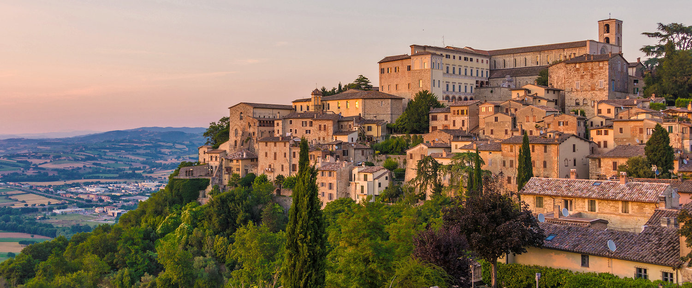

# Napoli - Todi

From Naples to Todi on foot.

## Maps

* [Napoli - Frosinone](https://www.google.com/maps/d/u/0/edit?mid=12UHYNq_lb03OU89U8HT2Omo7Cf_J-dMy&usp=sharing)
* [Frosinone - Roma](https://www.google.com/maps/d/u/0/edit?mid=1QmY3QGjLtRpsqGuP6Z1sBQ3TYbkrXiGZ&usp=sharing)
* [Roma - Todi](https://www.google.com/maps/d/u/0/edit?mid=1LA2dTdu8eIJquc3RNuvnnc5Tr69_zzGO&usp=sharing)

## Milestones

| Start                 | Start Milestone                                 | Finish                | Finish Milestone                                | Start Date | Finish Date | km    | Elapsed Time | Notes                | GPS                                                                       |
|-----------------------|-------------------------------------------------|-----------------------|-------------------------------------------------|------------|-------------|-------|--------------|----------------------|---------------------------------------------------------------------------|
| Caserta               | Stazione FS Caserta                             | Napoli                | Duomo                                           | 11/08/16   | 11/08/16    | 29.76 | 5:26:04      |                      |  [57acd29bdcd33b9a5a2bf523](gps/57acd29bdcd33b9a5a2bf523.gpx)             |
| Capua                 | Stazione FS Capua                               | Caserta               | Stazione FS Caserta                             | 14/08/16   | 14/08/16    | 16.45 | 2:53:19      |                      |  [57b0ad817f280ecf3ada967f](gps/57b0ad817f280ecf3ada967f.gpx)             |
| Sparanise             | Stazione FS Sparanise                           | Capua                 | Stazione FS Capua                               | 15/08/16   | 15/08/16    | 25.00 | 4:20:00      |                      | MISSING                                                                   |
| Teano                 | Stazione FS Teano                               | Sparanise             | Stazione FS Sparanise                           | 23/09/16   | 23/09/16    |  9.38 | 1:32:48      |                      |  [57e5260e08dad14c3af27848](gps/57e5260e08dad14c3af27848.gpx)             |
| Roccamonfina          | Chiesa collegiata di Santa Maria Maggiore       | Teano                 | Stazione FS Teano                               |            |             |       |              |                      |                                                                           |
| Mignano Monte Lungo   | Stazione FS Mignano Monte Lungo                 | Roccamonfina          | Chiesa collegiata di Santa Maria Maggiore       |            |             |       |              |                      |                                                                           |
| San Vittore del Lazio | Chiesa di San Nicola                            | Mignano Monte Lungo   | Stazione FS Mignano Monte Lungo                 |            |             |       |              |                      |                                                                           |
| Cassino               | Stazione FS Cassino                             | San Vittore del Lazio | Chiesa di San Nicola                            |            |             |       |              |                      |                                                                           |
| Aquino                | Stazione FS Piedimonte-Villa Santa Lucia-Aquino | Cassino               | Stazione FS Cassino                             |            |             |       |              |                      |                                                                           |
| Ceprano               | Stazione FS Ceprano-Falvaterra                  | Aquino                | Stazione FS Piedimonte-Villa Santa Lucia-Aquino |            |             |       |              |                      |                                                                           |
| Castro dei Volsci     | Stazione FS Castro-Pofi-Vallecorsa              | Ceprano               | Stazione FS Ceprano-Falvaterra                  |            |             |       |              |                      |                                                                           |
| Frosinone             | Stazione FS Frosinone                           | Castro dei Volsci     | Stazione FS Castro-Pofi-Vallecorsa              |            |             |       |              |                      |                                                                           |
| Morolo                | Stazione FS Morolo                              | Frosinone             | Stazione FS Frosinone                           |            |             |       |              |                      |                                                                           |
| Anagni                | Stazione FS Anagni-Fiuggi                       | Morolo                | Stazione FS Morolo                              | 01/05/21   | 01/05/21    | 12.30 | 2:01:07      |                      |                                                                           |
| Colleferro            | Stazione FS Colleferro-Segni-Paliano            | Anagni                | Stazione FS Anagni-Fiuggi                       | 13/03/21   | 13/03/21    | 11.21 | 2:13:14      |                      |  [Colleferro_Anagni](gps/Colleferro_Anagni.gpx)                           |
| Valmontone            | Stazione FS Valmontone                          | Colleferro            | Stazione FS Colleferro-Segni-Paliano            | 29/06/18   | 29/06/18    |  8.78 | 1:26:35      |                      |  [52b0aa16-3881-4427-8372-4b7fa3fbcbb7](gps/52b0aa16-3881-4427-8372-4b7fa3fbcbb7.gpx) |
| Palestrina            | Cattedrale di Sant'Agapito                      | Valmontone            | Stazione FS Valmontone                          |            |             |       |              |                      |                                                                           |
| Zagarolo              | Stazione FS Zagarolo                            | Palestrina            | Cattedrale di Sant'Agapito                      | 12/08/17   | 12/08/17    | 11.65 | 2:11:40      |                      |  [598ef2527f280ed4fbc281e3](gps/598ef2527f280ed4fbc281e3.gpx)             |
| Frascati              | Stazione FS Frascati                            | Zagarolo              | Stazione FS Zagarolo                            | 30/07/17   | 30/07/17    | 21.17 | 4:29:20      |                      |  [597e116771c40cc84a8f624b](gps/597e116771c40cc84a8f624b.gpx)             |
| Roma                  | Incrocio via Casilina - via di Tor Pignattara   | Frascati              | Stazione FS Frascati                            | 13/07/17   | 13/07/17    | 16.31 | 3:11:35      |                      |  [5967a36e1e7255a65b405392](gps/5967a36e1e7255a65b405392.gpx)             |
| Roma                  | Incrocio via Casilina - via di Tor Pignattara   | Monterotondo          | Stazione FS Monterotondo-Mentana                | 27/05/17   | 27/05/17    | 32.05 | 6:19:36      |                      |  [5929cee65f19b18c5bf08bd7](gps/5929cee65f19b18c5bf08bd7.gpx)             |
| Morlupo               | Stazione ferroviaria                            | Monterotondo          | Stazione FS Monterotondo-Mentana                | 29/06/17   | 29/06/17    | 14.84 | 2:33:59      |                      |  [59554f848a28a1fcc0338c14](gps/59554f848a28a1fcc0338c14.gpx)             |
| Rignano Flaminio      | Stazione ferroviaria                            | Morlupo               | Stazione ferroviaria                            | 09/07/17   | 09/07/17    |  9.15 | 1:38:31      |                      |  [59625800dcd33b82b458c954](gps/59625800dcd33b82b458c954.gpx)             |
| Rignano Flaminio      | Stazione ferroviaria                            | Civita Castellana     | Stazione FS Civita Castellana-Magliano          | 17/06/17   | 17/06/17    | 21.45 | 3:32:09      |                      |  [5945909b08cd12bb3d95ac9f](gps/5945909b08cd12bb3d95ac9f.gpx)             |
| Civita Castellana     | Stazione FS Civita Castellana-Magliano          | Narni                 | Concattedrale di San Giovenale                  | 03/06/17   | 03/06/17    | 30.16 | 4:31:20      |                      |  [5933240eda3113a3b2c03af8](gps/5933240eda3113a3b2c03af8.gpx)             |
| Narni                 | Concattedrale di San Giovenale                  | San Gemini            | Piazza San Francesco                            | 22/07/16   | 23/07/16    | 25.20 | 10:00:00     | sosta a Collescipoli | MISSING                                                                   |
| Todi                  | Chiesa di San Fortunato                         | San Gemini            | Piazza San Francesco                            | 01/07/17   | 01/07/17    | 29.66 | 5:30:09      |                      |  [5957e29e5f19b1a53da4bb1a](gps/5957e29e5f19b1a53da4bb1a.gpx)             |
